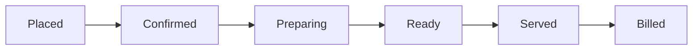

# 🍽️ Our Solution: The Smart Restaurant OS

**Team Name:** [Insert Team Name Here]  
**Hosted Application Link:** [Insert Hosted Link Here]

A full-stack, real-time restaurant management platform that digitizes the in-restaurant experience end-to-end. From AI-driven customer ordering to real-time kitchen Kanban boards and automated inventory tracking, Our Solution is the ultimate "Operating System" for modern dine-in restaurants.

> **Note to Judges:** This is **NOT** a food delivery app. This is a comprehensive B2B2C system built specifically to solve physical dine-in restaurant operations.

---

## 🚨 The Problem

Traditional restaurants rely on fragmented, manual processes that cause operational chaos:
- **Customers** suffer from slow service, paper menus without dietary context, and zero visibility into order status.
- **Kitchens (Back-of-House)** struggle with lost paper tickets, poor timing (e.g., mains arriving before starters), and untracked ingredient waste.
- **Management** lacks real-time operational insights and struggles to upsell effectively without being pushy.

## 💡 The Solution

Our Solution bridges the gap between the customer, the kitchen, and management through a **100% digitized, real-time, AI-enhanced workflow.** 

---

## ✨ Key Features

### 📱 For the Customer (Front-of-House)
* **QR-Based Table Ordering:** Scan a code to instantly view the menu and place orders—no waiting for a waiter.
* **Smart Digital Menu:** Rich menu items featuring dietary labels (Veg/Non-Veg) and comprehensive **Allergen warnings**.
* **AI-Powered Upselling:** Google Gemini analyzes the cart and suggests complementary dishes (e.g., "Add a Garlic Naan for your Butter Chicken") to boost AOV (Average Order Value).
* **Course Overrides & "Hold" Actions:** Customers can instruct the kitchen to bring an item as a starter or "Hold" a dish until they are ready.
* **Frictionless Auth:** Passwordless Sign-In via Email OTP/Magic Link and Google OAuth.
* **Pre-Ordering:** Customers can pre-order food alongside their table reservation.
* **Post-Dining Feedback:** Automated rating and feedback collection once the bill is settled.

### 🍳 For the Kitchen & Staff (Back-of-House)
* **Real-time Kanban Dashboard:** Orders instantly flow through a strict state machine: `Placed → Confirmed → Preparing → Ready → Served → Billed`.
* **Push Notifications:** Web Push API and Service Workers notify staff instantly when new orders are placed or assistance is requested.
* **Secure Staff Actions:** Sensitive actions (like billing or voids) require a secure Staff PIN.
* **Live Table Management:** Visual map of table statuses (Free, Occupied, Reserved) with real-time wait tracking.

### 📊 For Management (Operations)
* **Automated Inventory & Ingredient Tracking:** When a dish moves to "Preparing", the system automatically deducts raw ingredients from the inventory in real-time.
* **Gemini Ops Assistant:** A conversational AI agent for managers. Ask natural language questions like *"What sold best last night?"* or *"Which tables are running long?"*
* **Multi-Tenant Architecture:** Built from day one to support multiple restaurant branches (`restaurant_id` sharding).

---

## 🛠️ Tech Stack

Our Solution is built on the bleeding edge of the modern web:

| Layer | Technology |
| --- | --- |
| **Framework** | Next.js 15 (App Router, Server Actions, React 19 features) |
| **Styling** | Tailwind CSS v4, shadcn/ui, Framer Motion for micro-interactions |
| **Database & Auth** | Supabase (PostgreSQL, Row Level Security, Auth, Magic Links) |
| **Realtime Sync** | Supabase Realtime (WebSocket multiplexing) |
| **AI Integration** | Google Gemini API (Demand forecasting, Upselling, Ops Assistant) |
| **PWA / Push** | Service Workers & Web Push API for native-like notifications |

---

## 🚀 Order State Machine

We modeled our backend on enterprise POS systems (like Toast). Orders strictly follow this flow:


* **Placed:** Triggered by the customer.
* **State Transitions:** Triggered by staff. Every transition fires a Supabase Realtime event, instantly updating the customer's phone and the kitchen dashboard without a page reload.

---

## 🏁 Getting Started (Local Setup)

### Prerequisites
- Node.js 20+
- A [Supabase](https://supabase.com) project
- A [Google Gemini API key](https://ai.google.dev)

### Installation

```bash
# 1. Clone the repo
git clone <repo-url>
cd our-solution

# 2. Install dependencies
npm install

# 3. Setup Environment Variables
cp .env.local.example .env.local
# Fill in your Supabase URL, Anon Key, and Gemini API Key in .env.local

# 4. Run the development server
npm run dev
```
Open [http://localhost:3000](http://localhost:3000) to view the app.

---

## 📈 Scalability & Architecture Notes for Judges

- **Database Sharding:** The `restaurant_id` serves as a partition key across all major tables, allowing horizontal database scaling for franchise expansions.
- **WebSocket Efficiency:** Instead of polling, we use Supabase Realtime's connection multiplexing to efficiently handle concurrent connections per restaurant.
- **Serverless Compute:** Heavy operations (like AI prompt generation and inventory deduction) run on edge/serverless functions, ensuring the UI remains buttery smooth.

---
*Built with ❤️ for the Hackathon.*
