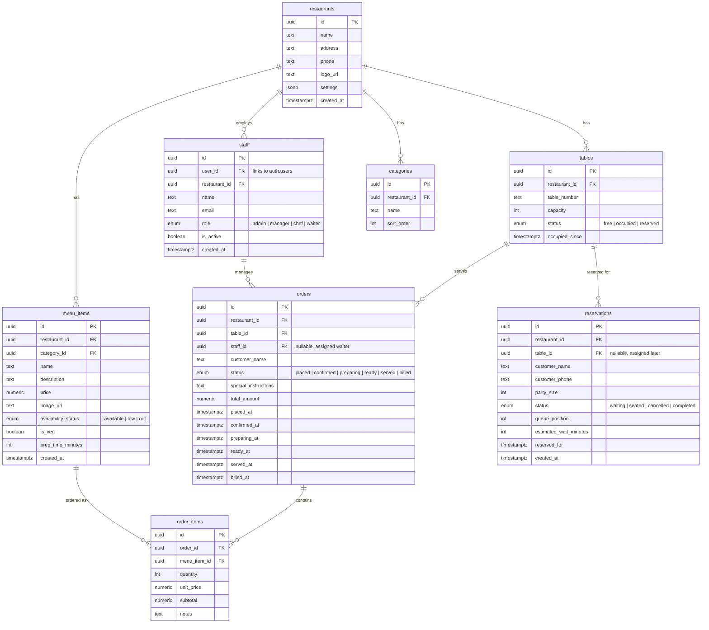

# Smart Restaurant Management System — Implementation Plan

## Problem Statement

Restaurants rely on manual processes causing operational inefficiencies: customers can't see real-time dish availability, long wait times, delayed communication between customers/staff/kitchen, manual billing/inventory, and lack of operational insights. We're building a **Smart Restaurant Management System** — not a food delivery clone — that digitizes the in-restaurant experience end-to-end.

## Tech Stack

| Layer | Technology |
|-------|-----------|
| Framework | Next.js 15 (App Router) — serves as both frontend & backend (API routes / Server Actions) |
| Styling | Tailwind CSS + shadcn/ui component library |
| Database | Supabase (Postgres + Realtime + Auth + Row Level Security) |
| AI | Google Gemini API (demand forecasting + ops assistant) |
| Deployment | Vercel |

## Order State Machine

Based on real POS systems (Petpooja, Toast):

```
placed → confirmed → preparing → ready → served → billed
```

Each transition is staff-initiated except `placed` (customer) and triggers a realtime event.

## Hackathon Tier Mapping

| Tier | Features |
|------|----------|
| **Bronze** | Menu display, basic ordering, table management |
| **Silver** | Real-time order tracking, staff dashboard, role-based access |
| **Gold** | Smart reservations, notifications, analytics, billing |
| **Platinum** | AI demand forecasting, realtime dish availability |
| **Bonus** | Gemini ops assistant, wait-time alerts, bidirectional realtime |

---

## Database Schema Overview



---

## Phase-by-Phase Plan

---

### Phase 0 — Project Scaffold
**Commit:** `init: project scaffold`

**What we do:**
- Initialize Next.js 15 with App Router, TypeScript, Tailwind CSS
- Install and initialize shadcn/ui (with `new-york` style, neutral base color, CSS variables)
- Create `.gitignore` (node_modules, .next, .env.local, etc.)
- Create `.env.local.example` with all required env vars listed (no values):
  ```
  NEXT_PUBLIC_SUPABASE_URL=
  NEXT_PUBLIC_SUPABASE_ANON_KEY=
  SUPABASE_SERVICE_ROLE_KEY=
  GEMINI_API_KEY=
  ```
- Write initial `README.md` with problem statement and order-state-machine research note
- Initialize git repo

**Files created:**
- Standard Next.js scaffold (`src/app/layout.tsx`, `src/app/page.tsx`, etc.)
- `tailwind.config.ts` (extended with shadcn)
- `components.json` (shadcn config)
- `.gitignore`, `.env.local.example`, `README.md`

**No UI yet** — just the default Next.js landing page confirming the app runs.

---

### Phase 1 — Supabase Schema
**Commit:** `feat: supabase schema`

**What we do:**
- Create `supabase/migrations/001_initial_schema.sql` with full DDL for all tables above
- Create enum types: `availability_status`, `order_status`, `table_status`, `staff_role`, `reservation_status`
- Add foreign keys, indexes, `created_at` defaults
- Add RLS policies (permissive for now, tightened later)
- Create a Supabase client utility: `src/lib/supabase/client.ts` (browser) and `src/lib/supabase/server.ts` (server-side)
- Create TypeScript types from the schema: `src/lib/types/database.ts`
- Add seed data script with 1 demo restaurant, ~15 menu items across 4 categories, 8 tables

**No UI changes** — schema-only phase.

**Files created:**
- `supabase/migrations/001_initial_schema.sql`
- `supabase/seed.sql`
- `src/lib/supabase/client.ts`
- `src/lib/supabase/server.ts`
- `src/lib/types/database.ts`

---

### Phase 2 — Auth (Email/OTP + Google OAuth + Roles)
**Commit:** `feat: auth with OTP and Google OAuth`

**What we do:**
- Install `@supabase/supabase-js` and `@supabase/ssr`
- Implement auth middleware (`src/middleware.ts`) that protects staff routes
- Build login/signup pages
- Wire up Google OAuth flow (redirect-based)
- Wire up Email + OTP verification flow
- Build auth callback handler (`/auth/callback`)
- Create auth context/hooks for client-side session management
- Role check utility: staff routes require `staff` table membership

**UI — Login / Sign Up Page** (`/login`):

```
┌─────────────────────────────────┐
│                                 │
│     🍽️  Smart Restaurant       │
│        Management System        │
│                                 │
│  ┌───────────────────────────┐  │
│  │  ✉️  Email                │  │
│  └───────────────────────────┘  │
│  ┌───────────────────────────┐  │
│  │  🔒 Password              │  │
│  └───────────────────────────┘  │
│                                 │
│  [ Sign In            ]  ← btn │
│                                 │
│  ─── or continue with ───       │
│                                 │
│  [ G  Sign in with Google ]     │
│                                 │
│  Don't have an account?         │
│  Sign Up                        │
│                                 │
└─────────────────────────────────┘
```

- **Design:** Dark background (slate-950), card with glass-morphism (backdrop-blur, subtle border), gradient accent on the sign-in button (amber-500 → orange-600 — warm restaurant palette), Google button white with shadow.
- **OTP flow:** After email signup, shows an OTP input field (6 digits, auto-focus between inputs).
- **Post-login routing:** Staff → `/dashboard`, Customer → `/menu`.

**Files created:**
- `src/app/login/page.tsx`
- `src/app/signup/page.tsx`
- `src/app/auth/callback/route.ts`
- `src/middleware.ts`
- `src/lib/supabase/middleware.ts`
- `src/hooks/use-auth.ts`
- `src/components/auth/login-form.tsx`
- `src/components/auth/signup-form.tsx`
- `src/components/auth/otp-input.tsx`

---

### Phase 3 — Deploy Skeleton to Vercel
**Commit:** `chore: deploy skeleton`

**What we do:**
- Add `vercel.json` if needed (usually not for Next.js)
- Ensure build succeeds: `npm run build`
- Configure env vars on Vercel (manual step — will need user to set them on the Vercel dashboard)
- Verify the deployed URL loads

**No UI changes** — deployment infrastructure only.

---

### Phase 4 — Customer Menu UI
**Commit:** `feat: customer menu UI`

**What we do:**
- Build the QR-code landing route: `/menu/[restaurantId]?table=3`
- Fetch menu items grouped by category from Supabase
- Build a mobile-first, card-based menu grid
- Category tabs/pills at top for filtering
- Cart sidebar/bottom sheet for item selection

**UI — Customer Menu** (`/menu/[restaurantId]?table=3`):

```
┌──────────────────────────────────┐
│ 🍽️ The Spice Garden    Table #3 │
│──────────────────────────────────│
│ [All] [Starters] [Mains] [Drinks│] [Desserts]   ← horizontal scroll pills
│──────────────────────────────────│
│ ┌──────────────┐ ┌──────────────┐│
│ │  🖼️ image    │ │  🖼️ image    ││
│ │              │ │              ││
│ │ Paneer Tikka │ │ Butter Naan  ││
│ │ 🟢 Veg       │ │ 🟢 Veg       ││
│ │ ₹249         │ │ ₹69          ││
│ │ ⏱️ 15 min    │ │ ⏱️ 8 min     ││
│ │              │ │              ││
│ │ [-] 0 [+]    │ │ [-] 0 [+]    ││
│ └──────────────┘ └──────────────┘│
│ ┌──────────────┐ ┌──────────────┐│
│ │  🖼️ image    │ │ 🖼️ image     ││
│ │              │ │  ░░░░░░░░░░  ││
│ │ Dal Makhani  │ │  OUT OF STOCK││
│ │ 🟢 Veg       │ │  Chicken     ││
│ │ ₹199         │ │  Biryani     ││
│ │ ⏱️ 20 min    │ │  🔴 Non-Veg  ││
│ │ [-] 0 [+]    │ │  ₹349        ││
│ └──────────────┘ └──────────────┘│
│──────────────────────────────────│
│  🛒 Cart (2 items) — ₹498       │
│  [ View Cart & Order ]           │
└──────────────────────────────────┘
```

- **Design:** Clean white/cream background with warm amber accents. Cards have rounded corners (xl), soft shadows, and a subtle hover lift animation. Veg/non-veg indicator as a small colored dot. Out-of-stock items are greyed out with reduced opacity and a strikethrough on the price. Category pills have an active state with amber fill. Bottom cart bar is sticky with a slide-up animation.
- **Mobile-first:** 2-column grid on mobile, 3-4 columns on tablet/desktop.
- **Cart bottom sheet:** Slides up showing item list, quantities, special instructions textarea, and a "Place Order" button.

**Files created:**
- `src/app/menu/[restaurantId]/page.tsx`
- `src/components/menu/category-tabs.tsx`
- `src/components/menu/menu-card.tsx`
- `src/components/menu/cart-sheet.tsx`
- `src/components/menu/quantity-selector.tsx`
- `src/lib/hooks/use-cart.ts`

---

### Phase 5 — Realtime Dish Availability
**Commit:** `feat: realtime dish availability`

**What we do:**
- Staff-side: Add an availability toggle on each menu item (available / low / out)
- Customer-side: Subscribe to Supabase Realtime channel `menu_items` table changes
- When staff changes availability, customer menu instantly updates:
  - `available` → normal card
  - `low` → amber "Limited" badge, still orderable
  - `out` → greyed out, strikethrough, unorderable, "Out of Stock" overlay
- No page refresh required — live reactive update

**UI — Staff Availability Toggle** (will live in staff dashboard later, for now a simple `/staff/menu` page):

```
┌─────────────────────────────────────────────┐
│ Menu Management                             │
│─────────────────────────────────────────────│
│ Item              Price  Status    Action    │
│─────────────────────────────────────────────│
│ Paneer Tikka      ₹249   🟢 Avail  [▾]     │
│ Butter Naan       ₹69    🟡 Low    [▾]     │
│ Chicken Biryani   ₹349   🔴 Out    [▾]     │
│ Dal Makhani       ₹199   🟢 Avail  [▾]     │
│─────────────────────────────────────────────│
│                                             │
│ [▾] dropdown: Available / Low Stock / Out   │
└─────────────────────────────────────────────┘
```

- **Dropdown uses shadcn `Select`** with color-coded options.
- **Realtime channel:** `supabase.channel('menu-changes').on('postgres_changes', { event: 'UPDATE', schema: 'public', table: 'menu_items' }, handler)`

**Files created/modified:**
- `src/app/staff/menu/page.tsx` [NEW]
- `src/components/staff/availability-toggle.tsx` [NEW]
- `src/lib/hooks/use-realtime-menu.ts` [NEW]
- `src/components/menu/menu-card.tsx` [MODIFIED — add realtime subscription]

---

### Phase 6 — End-to-End Order Management
**Commit:** `feat: end-to-end order management`

**What we do:**
- Customer places order → creates `orders` + `order_items` rows with status `placed`
- Order appears on staff/kitchen view via Realtime subscription
- Staff transitions order through: `placed → confirmed → preparing → ready → served`
- Customer sees status changes in real-time (live status bar on their screen)
- Server Action for each transition, validates the state machine (can't skip states)

**UI — Kitchen/Staff Order View** (`/staff/orders`):

```
┌──────────────────────────────────────────────────────────────┐
│ Kitchen Orders                                    [🔔 3 new]│
│──────────────────────────────────────────────────────────────│
│                                                              │
│  PLACED          CONFIRMED       PREPARING        READY      │
│  ┌──────────┐   ┌──────────┐   ┌──────────┐   ┌──────────┐ │
│  │ #ORD-042 │   │ #ORD-039 │   │ #ORD-037 │   │ #ORD-035 │ │
│  │ Table 3  │   │ Table 7  │   │ Table 1  │   │ Table 5  │ │
│  │ 3 items  │   │ 2 items  │   │ 4 items  │   │ 1 item   │ │
│  │ ⏱️ 2m    │   │ ⏱️ 5m    │   │ ⏱️ 12m   │   │ ⏱️ 18m   │ │
│  │          │   │          │   │          │   │          │ │
│  │ [Confirm]│   │ [Prep →] │   │ [Ready!] │   │ [Serve]  │ │
│  └──────────┘   └──────────┘   └──────────┘   └──────────┘ │
│  ┌──────────┐                                               │
│  │ #ORD-043 │                                               │
│  │ Table 6  │                                               │
│  │ 5 items  │                                               │
│  │ ⏱️ 0m    │                                               │
│  │ [Confirm]│                                               │
│  └──────────┘                                               │
└──────────────────────────────────────────────────────────────┘
```

- **Design:** Kanban-style columns, each with a distinct header color (placed=blue, confirmed=amber, preparing=orange, ready=green). Cards show order number, table, item count, and elapsed time. Action button advances to next state. New orders pulse with a subtle animation. Sound notification optional.

**UI — Customer Order Tracking** (shown on customer's screen after placing order):

```
┌──────────────────────────────────┐
│  Your Order #ORD-042             │
│  Table 3                         │
│──────────────────────────────────│
│                                  │
│  ●────●────◯────◯────◯────◯    │
│  Placed Confirmed                │
│         ↑ You are here           │
│                                  │
│  Items:                          │
│  • 1x Paneer Tikka    ₹249      │
│  • 2x Butter Naan     ₹138      │
│  • 1x Dal Makhani     ₹199      │
│  ──────────────────────          │
│  Total:                ₹586      │
│                                  │
│  Estimated wait: ~20 min         │
└──────────────────────────────────┘
```

- **Design:** Progress bar with 6 dots (one per state), filled dots are amber/green, current dot pulses. Clean card layout below.

**Files created:**
- `src/app/staff/orders/page.tsx`
- `src/app/order/[orderId]/page.tsx` (customer tracking view)
- `src/components/orders/order-kanban.tsx`
- `src/components/orders/order-card.tsx`
- `src/components/orders/order-status-bar.tsx`
- `src/components/orders/place-order-action.ts` (Server Action)
- `src/lib/hooks/use-realtime-orders.ts`
- `src/lib/actions/order-actions.ts` (state transition Server Actions)

---

### Phase 7 — Reservations & Queue Management
**Commit:** `feat: reservations and queue management`

**What we do:**
- Customer-facing: Join queue or make a reservation with party size
- Calculate estimated wait time from average table turnover (query recent orders' `placed_at` to `billed_at` durations)
- Staff-facing: See queue, seat parties, mark tables as free
- Realtime updates on queue position

**UI — Customer Reservation Page** (`/reserve/[restaurantId]`):

```
┌──────────────────────────────────┐
│  🍽️ The Spice Garden            │
│  Reserve a Table                 │
│──────────────────────────────────│
│                                  │
│  ┌────────────────────────────┐  │
│  │ Your Name                  │  │
│  └────────────────────────────┘  │
│  ┌────────────────────────────┐  │
│  │ Phone Number               │  │
│  └────────────────────────────┘  │
│  ┌────────────────────────────┐  │
│  │ Party Size    [- 2 +]      │  │
│  └────────────────────────────┘  │
│                                  │
│  📊 Current Wait: ~15 min       │
│  👥 3 parties ahead of you      │
│                                  │
│  [ Join Waitlist ]               │
│  [ Reserve for Later → ]        │
│                                  │
└──────────────────────────────────┘
```

After joining:

```
┌──────────────────────────────────┐
│  You're in the queue! 🎉        │
│                                  │
│  Position: #4                    │
│  Estimated wait: ~15 min         │
│                                  │
│  ┌──────────────────────────┐    │
│  │  ████████░░░░░░░░░░░░░░  │    │
│  │  40% — almost there!     │    │
│  └──────────────────────────┘    │
│                                  │
│  We'll notify you when your      │
│  table is ready.                 │
│                                  │
│  [ Cancel Reservation ]          │
└──────────────────────────────────┘
```

**Files created:**
- `src/app/reserve/[restaurantId]/page.tsx`
- `src/components/reservations/reservation-form.tsx`
- `src/components/reservations/queue-status.tsx`
- `src/lib/actions/reservation-actions.ts`
- `src/lib/utils/wait-time-calculator.ts`

---

### Phase 8 — Customer Notifications
**Commit:** `feat: customer notifications`

**What we do:**
- In-app toast/banner notifications on the customer screens when:
  - Order status changes (e.g. "Your order is now being prepared!")
  - Table is ready (for reservation queue)
  - An item they ordered goes out of stock (substitute suggestion)
- Use shadcn `Toast` / `Sonner` for the notification UI
- Driven by Realtime subscriptions already in place

**UI — Notification Toast:**

```
┌──────────────────────────────────────┐
│ 🔔 Order Update                  ✕  │
│ Your order #ORD-042 is now being     │
│ prepared! Estimated: 15 min          │
└──────────────────────────────────────┘
```

- Appears as a slide-in from top-right (desktop) or top-center (mobile).
- Auto-dismiss after 5 seconds, with a progress bar.
- Different colors per type: order update (amber), table ready (green), out-of-stock warning (red).

**Files created:**
- `src/components/notifications/notification-provider.tsx`
- `src/components/notifications/notification-toast.tsx`
- `src/lib/hooks/use-notifications.ts`

---

### Phase 9 — Staff Management Dashboard
**Commit:** `feat: staff management dashboard`

This is the largest phase. We build the full staff dashboard with a sidebar layout and multiple pages.

**UI — Dashboard Layout** (`/dashboard`):

```
┌─────────────────────────────────────────────────────────────────┐
│  🍽️ Smart Restaurant        [🔔]  [👤 Admin ▾]                │
│─────────────────────────────────────────────────────────────────│
│  ┌─────────┐  ┌─────────────────────────────────────────────┐  │
│  │ 📊 Home │  │                                             │  │
│  │ 📋 Orders│  │   Dashboard Home                           │  │
│  │ 🪑 Tables│  │                                             │  │
│  │ 🍽 Menu  │  │   ┌──────┐ ┌──────┐ ┌──────┐ ┌──────┐    │  │
│  │ 📦 Stock │  │   │Active│ │Tables│ │Revenue│ │Avg   │    │  │
│  │ 👥 Staff │  │   │Orders│ │In Use│ │Today │ │Wait  │    │  │
│  │ 👤 Guests│  │   │  12  │ │ 6/10 │ │₹24.5K│ │18 min│    │  │
│  │ 💰 Sales │  │   └──────┘ └──────┘ └──────┘ └──────┘    │  │
│  │ 📈 Stats │  │                                             │  │
│  │ 🤖 AI    │  │   Recent Orders          Table Map          │  │
│  │          │  │   ┌─────────────┐        ┌──────────────┐  │  │
│  │          │  │   │ #42 Table 3 │        │ [1]🟢 [2]🟢 │  │  │
│  │          │  │   │ Preparing   │        │ [3]🟡 [4]⚪  │  │  │
│  │          │  │   │ #41 Table 7 │        │ [5]🟢 [6]🔴  │  │  │
│  │          │  │   │ Served      │        │ [7]🟡 [8]⚪  │  │  │
│  │          │  │   └─────────────┘        └──────────────┘  │  │
│  └─────────┘  └─────────────────────────────────────────────┘  │
└─────────────────────────────────────────────────────────────────┘
```

**Sub-pages (each a route under `/dashboard/`):**

| Route | Content |
|-------|---------|
| `/dashboard` | KPI cards (active orders, tables, revenue, avg wait), recent orders list, table map |
| `/dashboard/orders` | Full Kanban view from Phase 6 (moved here) |
| `/dashboard/tables` | Visual table grid with status colors, click to see details/assign |
| `/dashboard/menu` | Menu item CRUD, availability toggles from Phase 5 (moved here) |
| `/dashboard/inventory` | Stock levels per item, low-stock alerts, restock actions |
| `/dashboard/staff` | Staff list, role management, add/remove staff members |
| `/dashboard/customers` | Recent customers, order history per customer |
| `/dashboard/sales` | Revenue chart (daily/weekly), top items, payment breakdown |
| `/dashboard/analytics` | Order volume over time, peak hours, category breakdown |
| `/dashboard/ai` | AI assistant + demand forecasting (built in Phase 11-12) |

- **Design:** Dark sidebar (slate-900), main content area on slate-50. Sidebar items have amber hover/active states. KPI cards have subtle gradients. Charts use Recharts library. Table map uses colored circles (green=free, yellow=occupied, red=reserved).

**Files created:**
- `src/app/dashboard/layout.tsx`
- `src/app/dashboard/page.tsx`
- `src/app/dashboard/orders/page.tsx` (absorbs Phase 6 staff view)
- `src/app/dashboard/tables/page.tsx`
- `src/app/dashboard/menu/page.tsx` (absorbs Phase 5 staff view)
- `src/app/dashboard/inventory/page.tsx`
- `src/app/dashboard/staff/page.tsx`
- `src/app/dashboard/customers/page.tsx`
- `src/app/dashboard/sales/page.tsx`
- `src/app/dashboard/analytics/page.tsx`
- `src/components/dashboard/sidebar.tsx`
- `src/components/dashboard/kpi-card.tsx`
- `src/components/dashboard/table-map.tsx`
- `src/components/dashboard/stats-chart.tsx`

---

### Phase 10 — Billing
**Commit:** `feat: billing`

**What we do:**
- Generate a bill for an order/table from `order_items`
- Bill shows itemized list, subtotal, taxes (GST 5%), grand total
- Staff marks order as `billed` (final state)
- Printable bill view (CSS `@media print`)
- Customer can also view their bill

**UI — Bill View:**

```
┌──────────────────────────────────┐
│       THE SPICE GARDEN           │
│     123 Food Street, Mumbai      │
│     GSTIN: 27XXXXX1234X1Z5       │
│──────────────────────────────────│
│  Bill #B-042        Table 3      │
│  Date: 25 Jul 2026, 9:30 PM     │
│──────────────────────────────────│
│  Item            Qty   Amount    │
│  ──────────────────────────────  │
│  Paneer Tikka     1    ₹249.00  │
│  Butter Naan      2    ₹138.00  │
│  Dal Makhani      1    ₹199.00  │
│  ──────────────────────────────  │
│  Subtotal              ₹586.00  │
│  CGST (2.5%)            ₹14.65  │
│  SGST (2.5%)            ₹14.65  │
│  ──────────────────────────────  │
│  GRAND TOTAL           ₹615.30  │
│──────────────────────────────────│
│  Thank you for dining with us!   │
│──────────────────────────────────│
│  [ 🖨️ Print ]  [ 📧 Email ]    │
└──────────────────────────────────┘
```

**Files created:**
- `src/app/bill/[orderId]/page.tsx`
- `src/components/billing/bill-view.tsx`
- `src/components/billing/bill-actions.tsx`
- `src/lib/actions/billing-actions.ts`
- `src/app/dashboard/billing/page.tsx` (staff-side billing management)

---

### Phase 11 — Gemini Demand Forecasting
**Commit:** `feat: gemini demand forecasting`

**What we do:**
- Pull historical `order_items` data (last 7-30 days) from Supabase
- Send aggregated data to Gemini API with a structured prompt
- Gemini returns suggested prep quantities per dish for next service
- Display on staff dashboard with confidence indicators

**UI — Demand Forecast Panel** (`/dashboard/ai` — Forecasting tab):

```
┌──────────────────────────────────────────────────────┐
│  📊 AI Demand Forecast                              │
│  Based on last 7 days of order data                  │
│──────────────────────────────────────────────────────│
│                                                      │
│  Dinner Service Tonight (6 PM — 11 PM)              │
│                                                      │
│  Dish              Avg/Day  Predicted  Confidence    │
│  ────────────────────────────────────────────────    │
│  Paneer Tikka       18      22 servings  🟢 High    │
│  Butter Naan        45      52 servings  🟢 High    │
│  Chicken Biryani    12      15 servings  🟡 Med     │
│  Dal Makhani        14      16 servings  🟢 High    │
│  Gulab Jamun         8       6 servings  🟡 Med     │
│                                                      │
│  💡 Insight: Weekend dinner traffic is typically     │
│  22% higher. Prepare extra naan and biryani.         │
│                                                      │
│  [ 🔄 Refresh Forecast ]  [ 📋 Export Prep List ]   │
└──────────────────────────────────────────────────────┘
```

**Files created:**
- `src/app/api/ai/forecast/route.ts` (API route calling Gemini)
- `src/components/ai/forecast-panel.tsx`
- `src/lib/ai/gemini-client.ts`
- `src/lib/ai/forecast-prompt.ts`

---

### Phase 12 — Gemini Ops Assistant
**Commit:** `feat: gemini ops assistant`

**What we do:**
- Staff-facing chat-style interface on the dashboard
- Staff types natural-language questions
- Backend fetches relevant Supabase data based on intent, passes to Gemini with context
- Gemini generates human-readable answers
- Examples: "What sold best last night?", "Which tables are running long?", "How many orders today?"

**UI — Ops Assistant** (`/dashboard/ai` — Assistant tab):

```
┌──────────────────────────────────────────────────────┐
│  🤖 Ops Assistant                                    │
│  Ask anything about your restaurant operations       │
│──────────────────────────────────────────────────────│
│                                                      │
│  ┌────────────────────────────────────────────────┐  │
│  │ 👤 What sold best last night?                  │  │
│  └────────────────────────────────────────────────┘  │
│  ┌────────────────────────────────────────────────┐  │
│  │ 🤖 Based on last night's orders (6 PM-11 PM): │  │
│  │                                                │  │
│  │ 1. Butter Naan — 47 orders (₹3,243)           │  │
│  │ 2. Paneer Tikka — 23 orders (₹5,727)          │  │
│  │ 3. Chicken Biryani — 18 orders (₹6,282)       │  │
│  │                                                │  │
│  │ 💡 Biryani had the highest revenue despite     │  │
│  │ fewer orders due to its higher price point.    │  │
│  └────────────────────────────────────────────────┘  │
│  ┌────────────────────────────────────────────────┐  │
│  │ 👤 Which tables are running long right now?    │  │
│  └────────────────────────────────────────────────┘  │
│  ┌────────────────────────────────────────────────┐  │
│  │ 🤖 Tables exceeding avg service time (35 min):│  │
│  │                                                │  │
│  │ ⚠️ Table 3 — 52 min (order #ORD-037)          │  │
│  │ ⚠️ Table 7 — 41 min (order #ORD-039)          │  │
│  │                                                │  │
│  │ Consider checking in with these tables.        │  │
│  └────────────────────────────────────────────────┘  │
│                                                      │
│  ┌──────────────────────────────┐  [ Send ]          │
│  │ Type your question...        │                    │
│  └──────────────────────────────┘                    │
└──────────────────────────────────────────────────────┘
```

- **Design:** Chat bubbles with distinct styling for user (right-aligned, amber) and AI (left-aligned, slate). Markdown rendering in AI responses. Typing indicator animation while waiting.

**Files created:**
- `src/app/api/ai/assistant/route.ts`
- `src/components/ai/ops-assistant.tsx`
- `src/components/ai/chat-message.tsx`
- `src/lib/ai/assistant-prompt.ts`
- `src/lib/ai/data-fetcher.ts` (queries Supabase based on question intent)

---

### Phase 13 — Table Wait-Time Alerts
**Commit:** `feat: table wait-time alerts`

**What we do:**
- Calculate average order completion time across recent orders
- Flag any active order/table that exceeds the average by >25%
- Show visual alerts on the staff dashboard (both on the home page and orders page)
- Alert includes table number, elapsed time, and how much it exceeds the average

**UI — Wait Time Alerts (on Dashboard Home):**

```
┌──────────────────────────────────────────────┐
│ ⚠️ Long Wait Alerts                          │
│──────────────────────────────────────────────│
│ ┌──────────────────────────────────────────┐ │
│ │ 🔴 Table 3 — 52 min (avg: 35 min)       │ │
│ │    Order #ORD-037 • Status: Preparing    │ │
│ │    ████████████████████░░░░  +49% over   │ │
│ │                           [ View Order ] │ │
│ └──────────────────────────────────────────┘ │
│ ┌──────────────────────────────────────────┐ │
│ │ 🟡 Table 7 — 41 min (avg: 35 min)       │ │
│ │    Order #ORD-039 • Status: Ready        │ │
│ │    ██████████████████░░░░░░  +17% over   │ │
│ │                           [ View Order ] │ │
│ └──────────────────────────────────────────┘ │
└──────────────────────────────────────────────┘
```

- Cards pulse with a red/amber glow animation based on severity.

**Files created:**
- `src/components/dashboard/wait-time-alerts.tsx`
- `src/lib/utils/wait-time-analyzer.ts`
- Modified: `src/app/dashboard/page.tsx` (add alerts section)

---

### Phase 14 — Error & Loading States
**Commit:** `fix: error and loading states`

**What we do:**
- Add `loading.tsx` for every route group using Next.js App Router conventions
- Add `error.tsx` error boundaries for every route group
- Add skeleton loaders for:
  - Menu cards (shimmer rectangles)
  - Dashboard KPI cards (pulse animation)
  - Order kanban columns (skeleton cards)
  - Tables grid (skeleton circles)
- Add empty states ("No orders yet", "No menu items", etc.) with illustrations
- Add error retry buttons
- Wrap Supabase calls in try/catch with user-friendly error messages

**Files created:**
- `src/app/loading.tsx` (root)
- `src/app/error.tsx` (root)
- `src/app/dashboard/loading.tsx`
- `src/app/dashboard/error.tsx`
- `src/app/menu/[restaurantId]/loading.tsx`
- `src/app/menu/[restaurantId]/error.tsx`
- `src/components/ui/skeleton-card.tsx`
- `src/components/ui/empty-state.tsx`
- `src/components/ui/error-boundary.tsx`
- (Plus `loading.tsx`/`error.tsx` for other routes)

---

### Phase 15 — Scalability Notes & Secret Cleanup
**Commit:** `docs: scalability notes and secret cleanup`

**What we do:**
- Add scalability section to README covering:
  - Supabase Realtime scaling (connection multiplexing, channel limits)
  - Multi-location sharding strategy (restaurant_id as partition key)
  - CDN/Edge for static assets via Vercel
  - Database indexing strategy
  - Horizontal scaling with Vercel serverless
- Audit all files for hardcoded secrets (grep for API keys, passwords)
- Ensure `.env.local.example` is complete and `.env.local` is in `.gitignore`

**Files modified:**
- `README.md`
- `.env.local.example` (if needed)

---

### Phase 16 — Final README & Demo Script
**Commit:** `docs: final README and demo script`

**What we do:**
- Complete README with all submission fields:
  - Team Name (will ask user)
  - Tech Stack summary
  - User Stories mapped to Bronze/Silver/Gold/Platinum/Bonus
  - AI Usage section (Gemini features)
  - Hosted Application Link
  - Setup instructions
- Write `DEMO_SCRIPT.md` — a 90-second walkthrough:
  1. Customer scans QR → sees menu
  2. Staff marks an item "out of stock" → customer menu updates live
  3. Customer places order → appears in kitchen kanban
  4. Staff advances order through states → customer sees live updates
  5. Staff asks AI assistant "what sold best tonight?"
  6. Dashboard shows wait-time alerts
  7. Bill generated and viewed

**Files created/modified:**
- `README.md` (final version)
- `DEMO_SCRIPT.md`

---

## Round 2 Enhancements (Phase 17 - 23)

### Phase 17 — Course-Based Kitchen Sequencing & Priority
**Commit:** `feat: kitchen course sequencing and wait times`

**What we do:**
- **Course Segregation:** Update `menu_items` schema to add a `course_category` enum (starter, main, dessert, beverage).
- **Kitchen Priorities:** Modify the kitchen kanban to visually group order items by course, indicating to the chef exactly what to prepare first (e.g., Starters before Mains).
- **Dynamic Prep Times:** Calculate wait times based on the aggregation of `prep_time_minutes` of the items requested (handling parallel vs sequential prep logic).
- **Custom Chef Overrides:** Allow chefs to manually override or extend the wait time for specific orders from their dashboard.
- **Live User Wait Times:** Display these calculated, real-time wait estimates for each course on the customer's tracking screen.

### Phase 18 — Add-to-Order (Continuous Ordering)
**Commit:** `feat: continuous ordering`

**Dependencies:** Relies on Phase 17 (`course_category`) for Course Timing, and Phase 10 (Billing) for Rolling Bill.

**What we do:**
- **Continuous Cart:** Allow customers to seamlessly append items to an *existing active order* without generating a completely new order ID. (e.g., ordering more naan or dessert halfway through the meal).
- **Course Timing:** Enable customers to specify course timing (e.g., "Bring this as Starter" or "Bring as Main") when adding items to the active order.
- **Rolling Bill:** Maintain a single rolling bill that accumulates all additions over the session, automatically grouped by table.

### Phase 19 — Advanced Table & Reservation Management
**Commit:** `feat: advanced reservations and modifiers`

**Dependencies:** "Hold & Fire" pacing relies on Phase 17 (`course_category`). Pre-ordering relies on Phase 7 (Reservations).

**What we do:**
- **Pre-Ordering:** Implement pre-ordering for waitlisted customers, firing the order automatically when their status changes to `seated`.
- **Hold & Fire Pacing:** Implement a "Hold & Fire" system, allowing waiters or customers to place an order but put the Main Course on "Hold", and then manually "Fire" it to the kitchen.
- **Modifiers:** Add support for item modifiers (e.g., "Less Spicy", "Extra Cheese", "Jain") with dynamic pricing adjustments stored in a JSONB `modifiers` column on `order_items`.
- **Bill Splitting:** Implement bill splitting functionality so customers at a table can easily split the final check by equal fractions or by items from their mobile devices.

### Phase 20 — Ingredient-Level Inventory Management
**Commit:** `feat: ingredient inventory tracking`

**What we do:**
- **Raw Ingredients Schema:** Create tables for `ingredients` and `recipe_ingredients` (mapping menu items to their raw ingredients and quantities).
- **Auto-Deduction:** Automatically deduct raw ingredient quantities from the inventory when an order moves to the "preparing" or "served" state.
- **Low Stock Alerts:** Alert the chef/manager when specific raw ingredients (e.g., tomatoes, paneer) fall below a defined threshold.
- *Note: Moved up in priority to provide the necessary data schema for displaying dish ingredients in the menu.*

### Phase 21 — Menu Enhancements (Ingredients & Multi-Language)
**Commit:** `feat: dish ingredients and i18n`

**Dependencies:** "View Ingredients" strictly relies on the `ingredients` and `recipe_ingredients` tables created in Phase 20.

**What we do:**
- **View Ingredients & Allergens:** Add an "Ingredients / Allergens" section to the menu items so customers can tap a dish to see exactly what goes into it, dynamically fetched from the recipe schema.
- **Multi-Language Support (i18n):** Implement internationalization, allowing customers to view the menu and interface in multiple languages (e.g., English, Hindi, Spanish).

### Phase 22 — Post-Dining Feedback System
**Commit:** `feat: customer feedback system`

**Dependencies:** Triggers immediately after Phase 10 (Billing).

**What we do:**
- **Feedback Prompt:** Trigger a clean, mobile-friendly feedback modal immediately after the bill is paid.
- **Ratings & Reviews:** Collect star ratings for food, service, and ambiance, along with an optional text review.
- **Staff Dashboard Integration:** Display aggregated feedback scores and recent reviews on the restaurant manager's dashboard.

### Phase 23 — Customer Messaging & AI Upselling (SMS/WhatsApp)
**Commit:** `feat: customer messaging and upselling`

**Dependencies:** AI Upselling relies on course sequencing from Phase 17.

**What we do:**
- **Out-of-App Notifications:** Integrate Twilio or a similar service to send SMS/WhatsApp updates for order status, queue position, or table readiness, because customers won't keep the website open indefinitely.
- **AI Upselling via Message:** Use Gemini AI to analyze the customer's current order and send a smart, timely text recommendation (e.g., "Looks like you just finished your Starters! Would you like to add some Gulab Jamun for dessert? Reply 'YES' to add to your order.")
- *Note: This sits as the final priority as it requires external 3rd-party API integrations and approvals.*

---

## Verification Strategy

| Phase | Verification |
|-------|-------------|
| 0 | `npm run dev` → Next.js welcome page loads |
| 1 | SQL migration runs without errors against Supabase |
| 2 | Can sign up, verify OTP, log in, see role-based routing |
| 3 | Deployed URL loads on Vercel |
| 4 | Menu page renders with seed data, category filter works |
| 5 | Toggle availability on staff page → customer menu updates without refresh |
| 6 | Place order → see it in kitchen → advance states → customer sees updates |
| 7 | Join queue → see position → get seated |
| 8 | Status change triggers toast notification on customer screen |
| 9 | All dashboard pages render with data |
| 10 | Generate and view itemized bill with tax |
| 11 | Forecast panel shows AI predictions |
| 12 | Ask a question → get data-backed answer |
| 13 | Long-wait tables flagged with alerts |
| 14 | Every page has loading skeleton + error state |
| 15 | No secrets in code, scalability documented |
| 16 | README complete, demo script coherent |

---

## Color Palette & Design System

| Token | Value | Usage |
|-------|-------|-------|
| Primary | `amber-500` (#f59e0b) | CTAs, active states, accents |
| Primary Dark | `amber-600` (#d97706) | Hover states |
| Background | `slate-950` (#020617) | Dark mode backgrounds |
| Surface | `slate-900` (#0f172a) | Cards, sidebar |
| Surface Light | `slate-50` (#f8fafc) | Light mode content area |
| Text | `slate-100` (#f1f5f9) | Primary text (dark mode) |
| Success | `emerald-500` (#10b981) | Available, completed |
| Warning | `amber-500` (#f59e0b) | Low stock, alerts |
| Danger | `red-500` (#ef4444) | Out of stock, errors |
| Info | `blue-500` (#3b82f6) | Informational |

**Typography:** Inter (via `next/font/google`) — clean, modern, highly readable.

> [!IMPORTANT]
> Before I begin execution, I need the following from you:
> 1. **Supabase project URL and anon key** — Have you already created a Supabase project?
> 2. **Google OAuth credentials** — Do you have a Google Cloud project with OAuth consent screen configured?
> 3. **Gemini API key** — Do you have one ready?
> 4. **Team Name** — For the final README.
> 5. **Do you want me to proceed with Phase 0 now?**
